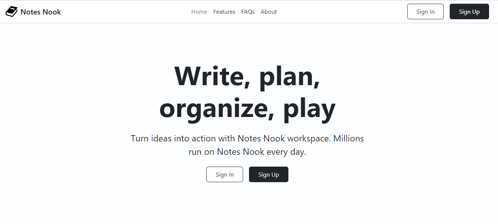
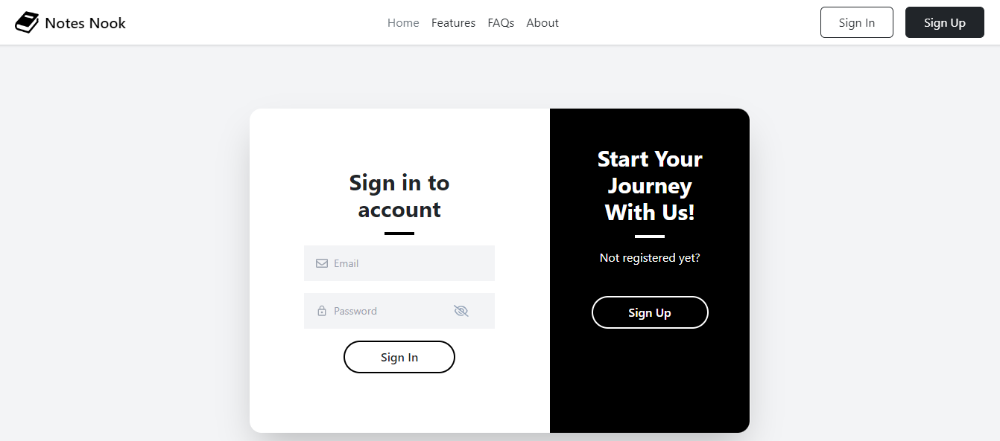
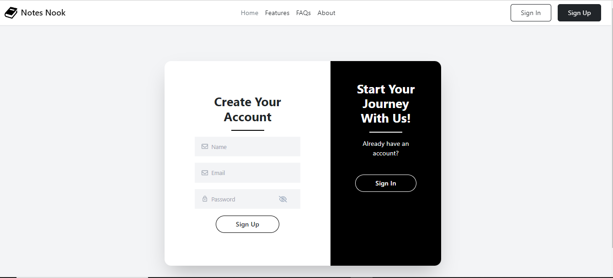
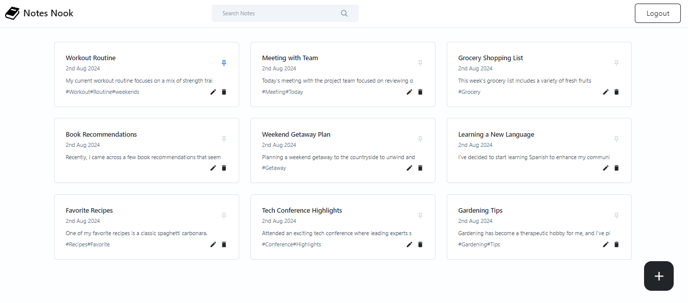
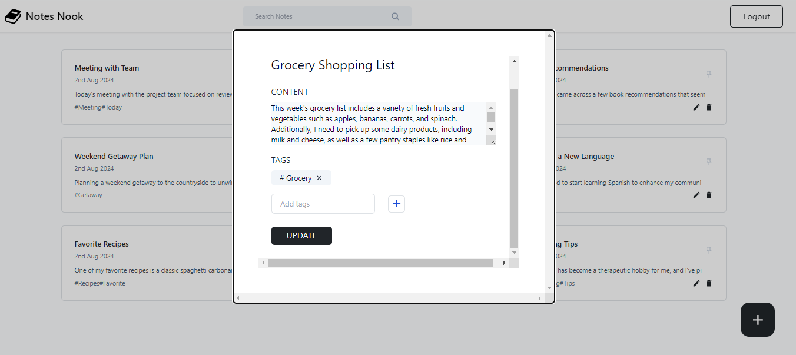
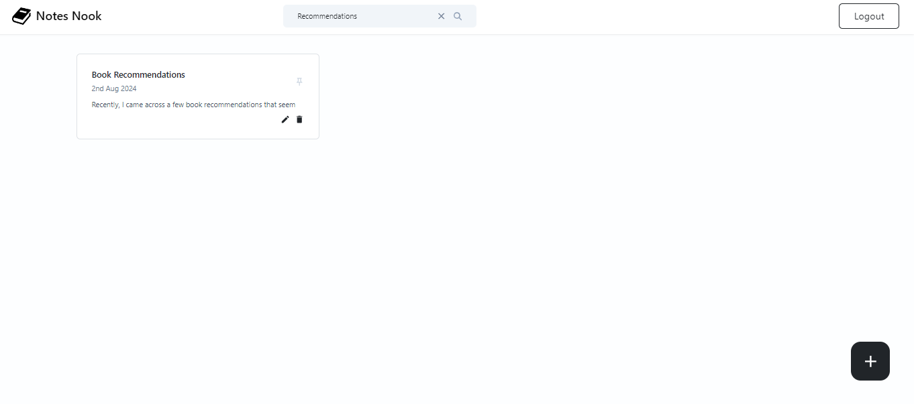

# Notesnook

Notesnook is a powerful note-taking application built using the MERN stack (MongoDB, Express, React, Node.js). It allows users to sign up or log in, create, delete, search, pin, and edit notes with title, content, and tags.

## Tech Stack

### Frontend

- REACT
- BOOTSTRAP
- TAILWIND CSS
- AXIOS
- JEST

### Backend

- NODE.JS
- EXPRESS
- MongoDB
- MOCHA
- CHAI
- JSON WEB TOKENS
- PINO
- PINO-PRETTY

# Features

- User Authentication: Secure user login and registration.
- CRUD Operations: Create, Read, Update, and Delete operations for managing data.
- Responsive Design: User-friendly interface that adapts to various screen sizes.
- RESTful API: Backend API for handling client requests.

### Home Page

### Sign In

### Sign up

### Dashboard

### Add note

### Search note

# Getting Started

## Prerequisites

Make sure you have the following installed on your machine:

- Node.js
- npm (Node Package Manager)
- MongoDB

# Set Up

Clone the Repository
First, clone the repository:

- git clone <repository-url>
- cd <repository-directory>

## Fetch All Branches

- Fetch all branches from the remote repository:

git fetch --all

- List All Branches

git branch -a

You should see something like:

- main
- remotes/origin/develop

- Check Out the prod Branch
  Create a local tracking branch for prod and switch to it:

git checkout -b prod origin/prod

- Verify the Branch
  Ensure you are on the prod branch and that it is up to date:

git branch

## Install Dependencies

### Backend

Navigate to the backend directory and install the dependencies:

- cd backend
- npm install

### Frontend

Navigate to the frontend directory and install the dependencies:

- cd ../frontend/note-nook
- npm install

## Set Up Environment Variables

The following environment variables are required to run this project.

For the .env file

- `ACCESS_TOKEN_SECRET`: Json Web Token
- `PORT`: The port number on which you want to run your server
- `TOKEN_EXPIRY`: The JWT expiration time. For example 20h

For the .env.development file

- `MONGO`: MongoDB connection string for storing user data

For the .env.test file

- `MONGO`: MongoDB connection string for storing testing data

Create .env files. There are .env.example files provided which you can copy and rename to .env, then fill in the necessary values.

### For the backend:

- cd ../backend # Navigate back to the backend directory
- cp .env.example .env
- cp .env.test.example .env.test
- cp .env.development.example .env.development

### Start the Server

Start the Backend Server

- cd ../backend
- npm start

### Start the Frontend Server

- cd ../frontend/note-nook
- npm run dev

## Running Tests

### Frontend Unit Tests

Navigate to the frontend directory and run the tests:

- cd ../frontend/note-nook
- npm test

### Backend Unit Tests

Navigate to the backend directory and run the tests:

- cd ../backend
- npm test

## Additional Features and Information

- Searcbar : we can search for a note by its title or content
- Pin a Note : we can pin notes so that important notes appears on top of the screen

# License

This project is licensed under the MIT License - see the LICENSE file for details.

# Acknowledgments

Special thanks to the 10Pearls team.

## MERN Track Team:

- Usama Bin Yousuf
- Mohmmad Noman
- Rimsha Abid
- Syed Muhammad Bakhtiyar

## Internship Team:

- Syed Anus Intizar Ahmed
- Ummara Amin
- Samia Ali
